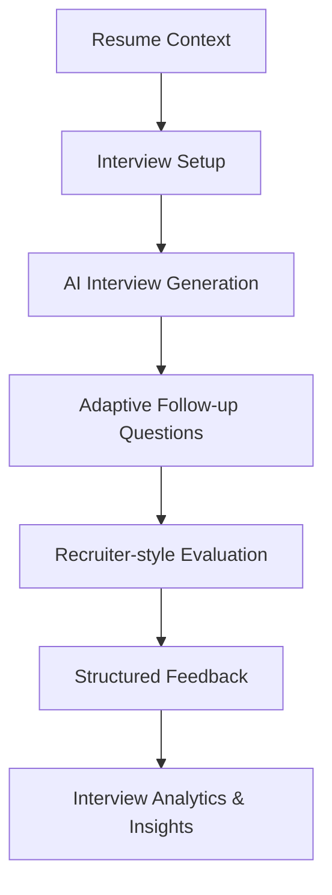

<p align="center">
  
</p>

<p align="center">
  AI-powered career acceleration platform for students, juniors, graduates and early-career professionals.
</p>

<p align="center">
  Practice realistic interviews, improve resumes, optimize recruiter perception and prepare for real hiring processes using modern AI workflows.
</p>

<p align="center">
  
  
  
  
  
  
</p>

---

# 🚀 Overview

**Launchly** is an AI-powered career growth platform designed to help users bridge the gap between learning technical skills and succeeding in real-world hiring processes.

The platform combines recruiter-style evaluations, resume-aware AI systems and realistic interview simulations to help users improve how they present themselves professionally.

Launchly focuses on realistic, profile-aware career preparation rather than generic AI coaching by grounding its recommendations in actual user data, recruiter-style evaluations and practical hiring signals.

---

# ✨ Core Features

## 🤖 AI Interview Simulator

A realistic AI-powered mock interview system with adaptive follow-up questions and recruiter-style evaluations.

### Features

- Resume-aware interview generation
- Behavioral, Technical and System Design interview modes
- Adaptive follow-up questioning
- Recruiter-style AI evaluations
- STAR-method analysis
- Communication & confidence analysis
- Interview scoring & telemetry
- Session history with persistent results
- Resume-context-aware questioning
- Difficulty levels (Junior / Mid / Senior)
- Role-aware interview pipelines
- Realistic recruiter feedback

### Interview Intelligence

The interview system dynamically adapts questions based on:

- visible resume skills
- projects & work experience
- selected role
- interview difficulty
- previous interview answers
- demonstrated technical depth

Unlike generic interview bots, Launchly avoids asking unrelated theoretical questions and instead focuses on realistic recruiter-style conversations.

---

## 📄 AI Resume Builder

An AI-assisted resume editing and evaluation system focused on recruiter expectations and real hiring workflows.

### Features

- Modern resume editor
- AI-assisted resume improvements
- Resume scoring & evaluation
- Recruiter-style resume feedback
- Resume parsing & structured extraction
- Context-aware resume analysis
- Bullet point improvement suggestions
- Resume clarity & readability analysis
- ATS-oriented optimization suggestions

---

## 👀 Recruiter View Analysis

Simulates how recruiters may perceive a candidate profile.

### Features

- Resume clarity analysis
- Attention & impact evaluation
- Weakness detection
- Recruiter-oriented insights
- Presentation quality feedback
- Technical depth perception analysis
- Communication quality signals
- Practical improvement recommendations

---

## 💼 Career Growth Tools

Additional AI-powered career preparation workflows.

### Included

- LinkedIn profile analysis
- LinkedIn optimization workflows
- Portfolio analysis
- Portfolio improvement suggestions
- Career readiness evaluation
- AI-powered coaching insights

---

## 🧭 AI Career Path Intelligence

Launchly includes an AI-powered career roadmap system that generates personalized career paths based on the user's real profile data.

Launchly analyzes actual resume content, projects, recruiter evaluations, interview results, portfolio signals and application history to determine how realistically a target role aligns with the user's current profile.

### Features

- Profile-aware AI roadmap generation
- Role-fit validation
- Career readiness scoring
- Personalized milestone planning
- AI-generated learning plans
- Portfolio project recommendations
- Recruiter-aligned improvement strategies
- Skill gap analysis
- Resume + portfolio + interview signal aggregation
- Realistic target-role alignment analysis

### Intelligent Role Alignment

Launchly does not blindly generate unrealistic roadmaps.

If a selected target role has little overlap with the user's existing profile data, the system:

- lowers roadmap confidence
- explains missing qualifications
- highlights critical skill gaps
- suggests realistic transition paths
- avoids generating irrelevant recommendations

This creates a significantly more realistic and trustworthy career planning experience.

---

## 🎨 Modern SaaS Experience

Launchly was designed with a premium modern SaaS experience in mind.

### UI Features

- Glassmorphism-inspired interface
- Responsive layouts
- Smooth animations & transitions
- Real-time AI interactions
- Modern dashboard workflows
- Structured recruiter-style UI patterns

---

# 🖥️ Platform Preview

## 🎬 Application Demo

<p align="center">
  
</p>

---

# 🎯 Built For

Launchly is designed for:

- Students
- Junior developers
- Graduates
- Career changers
- Bootcamp graduates
- Self-taught engineers
- Early-career professionals

---

# 🧠 AI Architecture

Launchly uses multiple structured AI workflows rather than relying on generic prompting.

## AI Systems

- Resume-aware prompting
- Context-aware interview generation
- Adaptive follow-up pipelines
- Structured evaluation rubrics
- Recruiter-style scoring systems
- Resume parsing & analysis pipelines
- Role-aware question generation
- AI-assisted recruiter simulations
- Career-context aggregation pipelines
- Profile-aware roadmap generation
- Role-fit validation systems
- Multi-source career signal analysis
- Career readiness scoring

---

# 🛠 Tech Stack

## Frontend

- React
- TypeScript
- Tailwind CSS
- Framer Motion
- TanStack Router
- React Query

## Backend

- FastAPI
- Python
- SQLAlchemy
- Pydantic
- JWT Authentication

## AI Systems

- OpenAI API
- Structured prompting pipelines
- Resume-aware AI systems
- Context-aware evaluation pipelines
- Recruiter-style scoring logic

## Infrastructure

- PostgreSQL
- JWT Authentication
- Vercel (planned deployment)
- Render (planned deployment)

---

# ⚙️ Installation

## Prerequisites

- Node.js >= 18
- Python >= 3.10
- Git

---

## 1. Clone Repository

```bash
git clone https://github.com/ilyassuelen/launchly
cd launchly
```

---

## 2. Backend Setup

```bash
cd backend

python -m venv .venv

# macOS / Linux
source .venv/bin/activate

# Windows PowerShell
.\.venv\Scripts\Activate.ps1

pip install -r requirements.txt

python -m uvicorn backend.app.main:app --reload
```

Backend runs on:

```txt
http://localhost:8000
```

---

## 3. Frontend Setup

```bash
cd ../frontend

npm install
npm run dev
```

Frontend runs on:

```txt
http://localhost:8080
```

---

# 🔐 Environment Variables

Create a `.env` file in the backend directory.

| Variable | Required | Description |
|---|---|---|
| OPENAI_API_KEY | ✅ | OpenAI API key |
| DATABASE_URL | ✅ | PostgreSQL connection string |
| JWT_SECRET_KEY | ✅ | JWT authentication secret |
| CORS_ORIGINS | ❌ | Allowed frontend origins |

---

# 📊 Current Capabilities

## Interview System

- Resume-aware AI interviews
- Behavioral interviews
- Technical interviews
- System Design interviews
- Adaptive follow-up logic
- Recruiter-style evaluations
- Session history & analytics
- Structured interview scoring

## Resume System

- AI resume analysis
- Resume parsing
- Resume scoring
- Recruiter-oriented resume feedback
- Structured resume evaluation

## Recruiter Intelligence

- Recruiter perception analysis
- Communication analysis
- Technical depth analysis
- Clarity & presentation analysis

## Career Tools

- LinkedIn analysis
- Portfolio analysis
- AI coaching workflows
- Job application tracking
- Application workflow management

## Career Path Intelligence

- AI-generated personalized career roadmaps
- Resume-aware role alignment analysis
- Profile-fit validation
- AI learning plan generation
- Portfolio project recommendations
- Skill gap intelligence
- Career readiness evaluation
- Recruiter-aligned application strategies

---

# 🧭 Roadmap

## Upcoming Improvements

- Voice-based AI interviews
- Real-time speech & communication analysis
- Live conversational interview mode
- Advanced recruiter analytics & heatmaps
- Enhanced portfolio intelligence
- Advanced hiring-readiness scoring

---

# 🏗 Example Interview Flow



---

# 🤝 Contributing

Contributions are welcome.

## Development Workflow

1. Fork the repository
2. Create a feature branch
3. Commit your changes
4. Push your branch
5. Open a Pull Request

---

# 📄 License

This project is licensed under the MIT License.