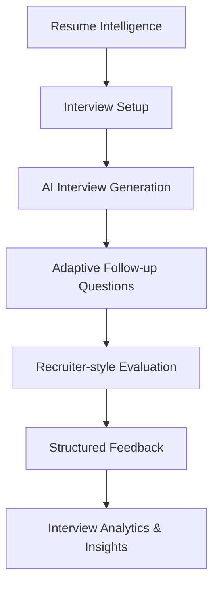

<p align="center">
  
</p>

<p align="center">
  AI-powered career acceleration platform for students, juniors, graduates and early-career professionals.
</p>

<p align="center">
  Build stronger resumes, simulate realistic interviews, improve recruiter perception and plan career growth with profile-aware AI workflows.
</p>

<p align="center">
  
  
  
  
  
  
</p>

---

# 🚀 Overview

**Launchly** is an AI-powered career growth platform that helps users prepare for real hiring processes with realistic, recruiter-style feedback.

Instead of giving generic AI coaching, Launchly grounds its recommendations in the user's actual career profile: resume content, structured skills, projects, recruiter evaluations, interview results, portfolio signals and application activity.

The goal is to help students, juniors, graduates and early-career professionals understand where they stand, improve their profile and move toward stronger job readiness.

---

# ✨ Core Features

## 📄 AI Resume Builder

A modern resume editor with persistent AI analysis, ATS-style scoring and recruiter-focused feedback.

### Features

- Modern resume editor with multiple templates
- AI resume analysis and ATS-style scoring
- Recruiter-style feedback and smart suggestions
- Structured skill, project and experience extraction
- Persistent analysis results after saving and page refresh
- Reusable resume intelligence for other features
- Resume photo upload and live preview
- PDF/export-ready resume preview

---

## 🧠 Structured Resume Intelligence

Launchly converts resume data into reusable structured career intelligence.

It extracts and stores signals such as:

- technical skills
- tools and technologies
- projects and implementation evidence
- experience signals
- seniority and candidate level
- ATS keywords
- role alignment indicators
- recruiter-facing strengths and proof gaps

This shared resume intelligence is reused by the Dashboard, Recruiter View, Career Path and Interview Simulator so the AI can reason from real profile data instead of isolated prompts.

---

## 🤖 AI Interview Simulator

A realistic AI mock interview system with adaptive follow-up questions and recruiter-style evaluations.

### Features

- Resume-aware interview generation
- Behavioral, Technical and System Design modes
- Junior / Mid / Senior difficulty levels
- Adaptive follow-up questioning
- STAR-method analysis
- Communication and confidence feedback
- Persistent interview sessions and scoring
- Role-aware interview pipelines

The interview flow adapts to visible resume skills, projects, selected role, difficulty and previous answers to create a more realistic interview experience.

---

## 👀 Recruiter View Analysis

Recruiter View simulates how a candidate profile may be perceived by hiring teams.

### Features

- Resume clarity analysis
- Attention and impact evaluation
- Technical depth perception
- Weakness and proof-gap detection
- Communication quality signals
- Practical recruiter-oriented improvement suggestions
- Resume-structured-data support for more grounded analysis

---

## 🧭 AI Career Path Intelligence

Career Path generates personalized roadmaps based on the user's real profile data.

It uses resume intelligence, projects, recruiter evaluations, portfolio signals, interview results and application activity to estimate how realistic a target role is for the current profile.

### Features

- Profile-aware AI roadmap generation
- Role-fit validation
- Career readiness scoring
- Skill gap analysis
- Learning plan generation
- Portfolio project recommendations
- Milestone planning
- Realistic target-role alignment analysis
- Evidence-based transition guidance

### Intelligent Role Alignment

Launchly does not blindly generate optimistic roadmaps.

If a selected target role has little overlap with the user's existing profile, the system lowers confidence, explains missing qualifications and suggests realistic transition steps instead of giving irrelevant advice.

---

## 📊 Career Dashboard

The dashboard combines signals across the platform into a single career readiness view.

### Features

- Career score overview
- Resume, recruiter, LinkedIn, portfolio, application and interview signals
- Profile strength breakdown
- Market-fit style positioning
- AI-generated insights and next best actions
- Weekly improvement plan
- Application activity heatmap
- Resume-structured-data-aware recommendations

---

## 💼 Additional Career Tools

Launchly also includes supporting workflows for broader career preparation:

- LinkedIn profile analysis
- Portfolio analysis
- Cover letter generation
- Job application tracking
- Application workflow management
- AI coaching-style insights

---

# 🖥️ Platform Preview

<p align="center">
  
</p>

---

# 🎯 Built For

Launchly is designed for:

- Students
- Junior developers
- Graduates
- Career changers
- Bootcamp graduates
- Self-taught engineers
- Early-career professionals

---

# 🧠 AI Architecture

Launchly uses several structured AI workflows that share profile context across features.

## AI Systems

- Resume analysis and structured extraction
- Persistent resume intelligence storage
- Cross-feature candidate profile context
- Recruiter-style evaluation prompts
- ATS-style scoring logic
- Interview question generation
- Adaptive follow-up generation
- Career roadmap generation
- Role-fit validation
- Dashboard insight generation
- Multi-source career signal aggregation

This architecture keeps AI outputs more consistent, grounded and reusable across the product.

---

# 🛠 Tech Stack

## Frontend

- React
- TypeScript
- Tailwind CSS
- Framer Motion
- TanStack Router
- React Query

## Backend

- FastAPI
- Python
- SQLAlchemy
- Pydantic
- JWT Authentication

## AI Systems

- OpenAI API
- Structured JSON prompting
- Resume-aware AI workflows
- Context-aware evaluation pipelines
- Recruiter-style scoring logic
- Cross-feature career signal aggregation

## Infrastructure

- PostgreSQL (Neon)
- Cloudflare R2 Object Storage
- Cloudflare Pages
- Render
- JWT Authentication

---

# ⚙️ Installation

## Prerequisites

- Node.js >= 18
- Python >= 3.10
- Git

---

## 1. Clone Repository

```bash
git clone https://github.com/ilyassuelen/launchly
cd launchly
```

---

## 2. Backend Setup

```bash
cd backend

python -m venv .venv

# macOS / Linux
source .venv/bin/activate

# Windows PowerShell
.\.venv\Scripts\Activate.ps1

pip install -r requirements.txt

python -m uvicorn backend.app.main:app --reload
```

Backend runs on:

```txt
http://localhost:8000
```

---

## 3. Frontend Setup

```bash
cd ../frontend

npm install
npm run dev
```

Frontend runs on:

```txt
http://localhost:8080
```

---

# 🔐 Environment Variables

Create a `.env` file in the backend directory.

| Variable | Required | Description |
|---|---|---|
| OPENAI_API_KEY | ✅ | OpenAI API key |
| DATABASE_URL | ✅ | PostgreSQL connection string |
| JWT_SECRET_KEY | ✅ | JWT authentication secret |
| CORS_ORIGINS | ❌ | Allowed frontend origins |

---

# 🧭 Roadmap

## Upcoming Improvements

- Voice-based AI interviews
- Real-time speech and communication analysis
- Live conversational interview mode
- Advanced recruiter analytics and heatmaps
- Enhanced portfolio intelligence
- Advanced hiring-readiness scoring

---

# 🏗 Example Interview Flow



---

# 🤝 Contributing

Contributions are welcome.

## Development Workflow

1. Fork the repository
2. Create a feature branch
3. Commit your changes
4. Push your branch
5. Open a Pull Request

---

# 📄 License

This project is licensed under the MIT License.